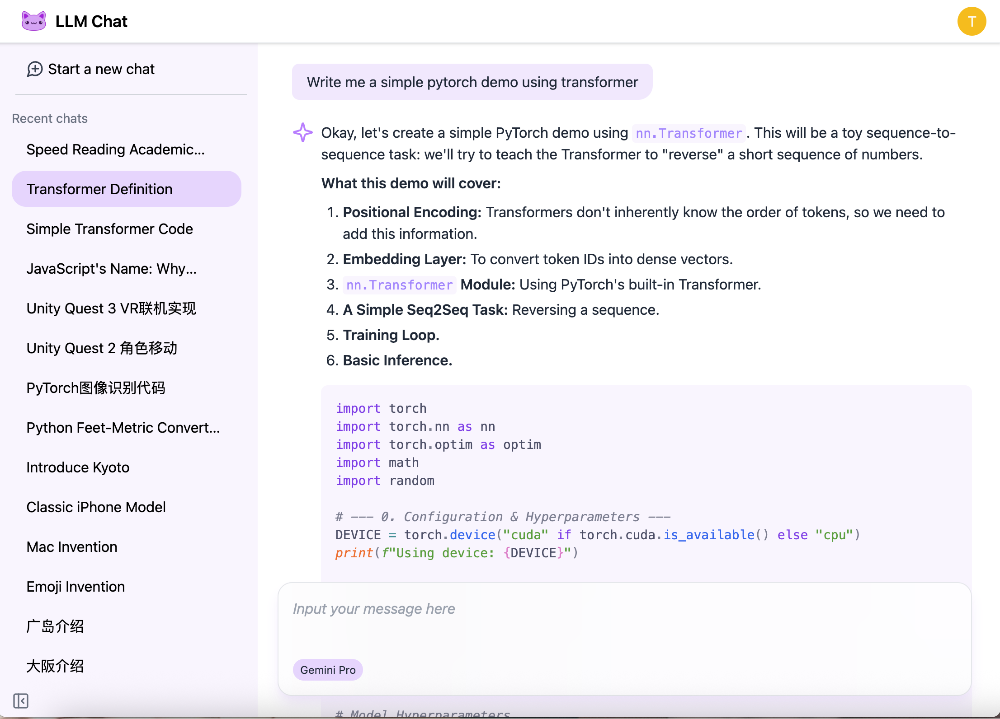

# llm-chat

:warning: A WIP project

A full-stack simple chat system for LLMs



## Tech Stack

**Backend:**

- Hono
- Drizzle ORM with SQLite
- Google Gemini API

**Frontend:**

- React + Vite
- Tailwindcss
- Shiki

## Current Features (WIP)

- 💬 Google Gemini, flash and pro
- 🔄 Streaming chat responses
- 📝 Auto-generate chat titles
- 👤 User management with JWT auth

## Development Setup

### Setup

```zsh
pnpm install
pnpm dev
```

### Environment

Create `backend/.env` with:

```
GOOGLE_API_KEY=your_gemini_api_key
JWT_SECRET=your_jwt_secret
```
